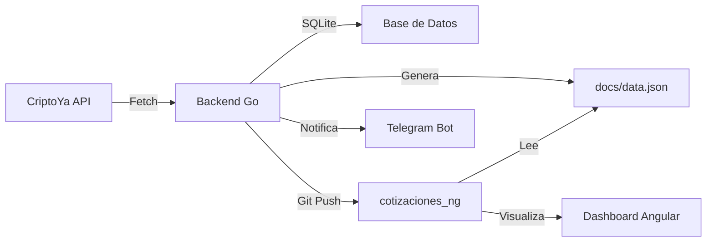

# 💰 CotizacionesNg

> **Dashboard interactivo en tiempo real** para visualizar cotizaciones de USDT (Binance P2P) construido con Angular 19.2.5

<div align="center">


</div>

---

## 🚀 ¿De qué trata el proyecto?

**CotizacionesNg** es el frontend de un sistema de monitoreo de cotizaciones de criptomonedas. Este proyecto funciona en conjunto con un [backend en Go](https://github.com/Programmercito/cotizaciones) que consulta la API de CriptoYa, almacena los datos en SQLite y genera archivos JSON que son consumidos por esta aplicación Angular.

### 🎯 Características principales

- 📊 **Visualización de cotizaciones** en tiempo real de USDT en Binance P2P
- 📈 **Gráficos interactivos** con histórico de precios
- 🔄 **Actualización automática** de datos desde el backend en Go
- 📱 **Diseño responsive** optimizado para todos los dispositivos
- 🎨 **UI/UX moderna** con Angular Material y SCSS

---

## 🛠️ Stack Tecnológico

### Frontend (este repo)
- **Framework:** Angular 19.2.5
- **Lenguaje:** TypeScript
- **Estilos:** SCSS
- **Testing:** Karma + Jasmine

### Backend ([cotizaciones](https://github.com/Programmercito/cotizaciones))
- **Lenguaje:** Go
- **Base de datos:** SQLite
- **Notificaciones:** Telegram Bot
- **Deploy:** Docker + Kubernetes (MicroK8s)
- **CI/CD:** GitHub Actions

---

## 🏗️ Arquitectura del Sistema



### 🔄 Flujo de Datos

1. **Backend Go** (job automático vía cron o GitHub Actions):
   - Consulta la API de CriptoYa cada X minutos
   - Guarda las cotizaciones en SQLite
   - Genera archivo `docs/data.json` con los datos actualizados
   - Hace git pull/push en el repositorio `cotizaciones_ng`
   - Envía notificaciones a Telegram

2. **Frontend Angular** (este proyecto):
   - Lee el archivo `docs/data.json` generado por el backend
   - Renderiza los datos en componentes visuales
   - Actualiza gráficos y tablas en tiempo real
   - Se despliega automáticamente en GitHub Pages

---

## 🚀 Cómo Levantar el Proyecto

### Prerrequisitos

```bash
node >= 18.x
npm >= 9.x
Angular CLI 19.2.5
```

### Instalación Local

```bash
# 1. Clonar el repositorio
git clone https://github.com/Programmercito/cotizaciones_ng.git
cd cotizaciones_ng

# 2. Instalar dependencias
npm install

# 3. Levantar servidor de desarrollo
ng serve

# 4. Abrir en el navegador
# Navega a http://localhost:4200/
```

La aplicación se recargará automáticamente cuando modifiques los archivos fuente.

---

## 📦 Cómo se Cargan los Datos (Backend Job)

El [backend en Go](https://github.com/Programmercito/cotizaciones) se ejecuta como un **job programado** que realiza las siguientes tareas:

### 🤖 Job Automático (GitHub Actions)

El workflow `.github/workflows/go.yaml` se dispara automáticamente en cada push a `main`:

```yaml
# Pasos del job:
1. 🌐 Consultar API de CriptoYa
2. 🗄️ Conectar a SQLite
3. 💾 Guardar cotización en BD
4. 📨 Enviar/Editar mensaje en Telegram
5. 🔄 Git pull forzado en cotizaciones_ng
6. 📝 Exportar cotizaciones a docs/data.json
7. 📤 Git commit & push a cotizaciones_ng
8. 🧹 Limpiar registros antiguos (>30 días)
```

### 📁 Estructura del archivo generado

El backend genera `docs/data.json` con esta estructura (array de objetos):

```json
[
  {
    "moneda": "USDT",
    "cotizacion": 9.09,
    "datetime": "2026-02-16 02:00:04",
    "exchange": "binancep2p"
  },
  {
    "moneda": "USDT",
    "cotizacion": 9.1,
    "datetime": "2026-02-16 07:15:01",
    "exchange": "binancep2p"
  }
]
```

**Campos:**
- `moneda`: Tipo de criptomoneda (USDT)
- `cotizacion`: Precio de compra (bid) en BOB
- `datetime`: Timestamp del registro (formato: `YYYY-MM-DD HH:MM:SS`)
- `exchange`: Exchange de origen (binancep2p)

---

## 📝 Comandos Disponibles

### Desarrollo

```bash
# Servidor de desarrollo
ng serve

# Generar componente
ng generate component nombre-componente

# Ver ayuda de scaffolding
ng generate --help
```

### Testing

```bash
# Ejecutar tests unitarios
ng test

# Ejecutar tests e2e
ng e2e
```

### Build

```bash
# Build de desarrollo
ng build

# Build de producción
ng build --configuration production

# Los archivos se generan en dist/
```

---

## 🌐 Deployment

El proyecto se despliega automáticamente en **GitHub Pages** usando GitHub Actions.

```bash
# El frontend está disponible en:
https://programmercito.github.io/cotizaciones_ng/
```

---

## 🤝 Integración con el Backend

Para que el sistema funcione completamente:

1. **Configurar el backend Go:**
   - Clonar [cotizaciones](https://github.com/Programmercito/cotizaciones)
   - Configurar variables de entorno (`TELEGRAM_BOT_TOKEN`, etc.)
   - Ejecutar el job (manual o automático)

2. **El backend automáticamente:**
   - Actualiza el archivo `docs/data.json` en este repo
   - Hace commit y push de los cambios
   - Dispara el deploy del frontend

---

## 📚 Recursos Adicionales

- 📖 [Documentación de Angular](https://angular.dev)
- 🔧 [Angular CLI Reference](https://angular.dev/tools/cli)
- 🐹 [Backend en Go](https://github.com/Programmercito/cotizaciones)
- 💬 [Telegram Bot API](https://core.telegram.org/bots/api)

---

## 📄 Licencia

Este proyecto es de código abierto y está disponible bajo la licencia MIT.

---

<div align="center">

**Hecho con ❤️ y Angular**

⭐ Si te gusta el proyecto, no olvides darle una estrella!

</div>
